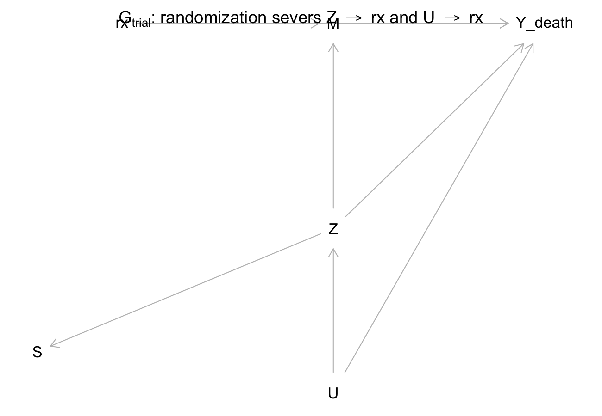
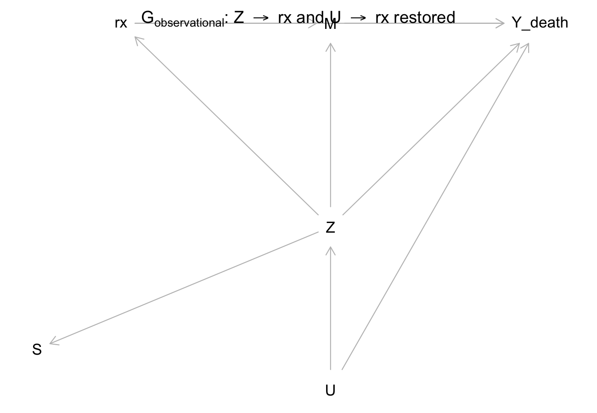
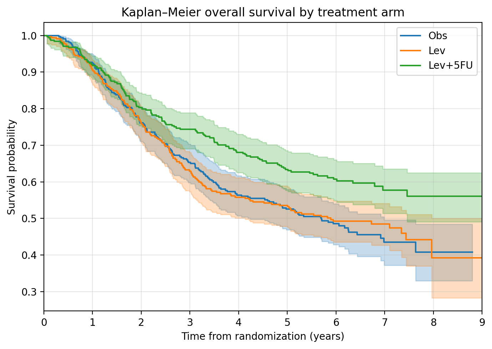
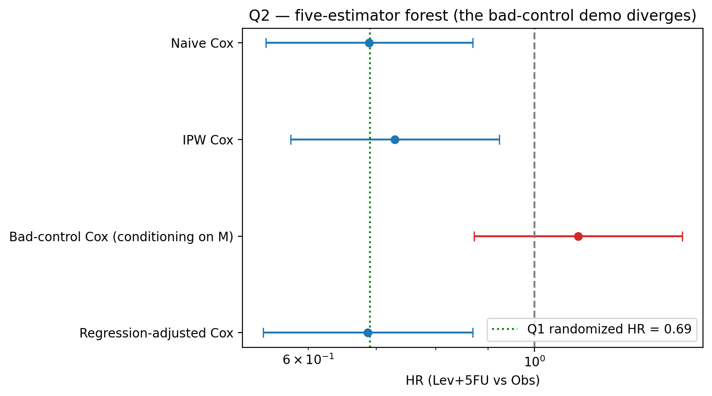
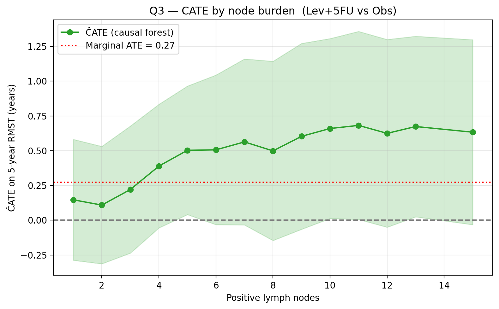
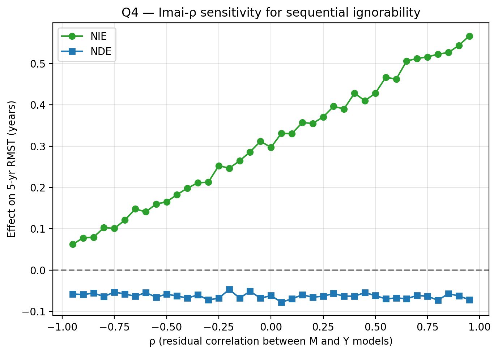

# Beyond the Hazard Ratio

**A causal-inference re-analysis of the Moertel 1990 adjuvant colon cancer trial.**

> **Course:** Causal Inference (Adam Kelleher, Spring 2026)
> **Target journal:** *Observational Studies*
> **Dataset:** `ForCausality::Colon_df` (a curated copy of `survival::colon`) — Moertel et al. NEJM 1990 trial of levamisole + 5-fluorouracil in resected stage B/C colon cancer (*n = 929*).

---

## Overview

The Moertel trial's headline statistic — a 33% reduction in death hazard, **HR ≈ 0.67** for Lev+5FU vs Observation — appears in every modern oncology textbook. The number is correct but causally incomplete: it elides the identifying assumptions, the absolute-scale benefit, the heterogeneity across patients, the mechanism, and the population to which it applies.

This project re-analyzes the same dataset through **five nested causal questions**, each with its estimand committed to writing *before* any estimator is run. The contract — [`00_estimands.qmd`](00_estimands.qmd) — pre-commits each estimand in `do(·)` or potential-outcomes notation, the 2×2 cell (statistical/causal × selection/no-selection), the graphical and non-graphical identification assumptions, the estimator, the failure mode if the assumption is wrong, the target population, and the naive-reader mistake. Every notebook downstream inherits this header.

Reproduction of Moertel's HR is **0.69 (95% CI 0.55–0.87)** — within the ±0.05 anchor tolerance — situated inside a single coherent framework: every downstream estimand inherits the same DAG, the same Z, and the same sensitivity scaffolding.

---

## Headline results

| # | Estimand | Estimate | 95% CI | Sensitivity bound |
|---|---|---|---|---|
| Q1 | Randomized HR (Lev+5FU vs Obs) | **0.69** | (0.55, 0.87) | E-value 2.26; Schoenfeld PH *p* = 0.26 |
| Q1 | ΔRMST(5y) | +0.31 yrs | — | — |
| Q1 | 5-year risk difference | −10.8 pp | — | — |
| Q2 | IPW Cox HR (back-door) | 0.73 | (0.58, 0.92) | E-value 2.08 |
| Q2 | AIPW ΔRMST(5y) | +0.28 yrs | (+0.09, +0.48) | doubly robust |
| Q2 | DML ΔRMST(5y) | +0.18 yrs | (−0.06, +0.42) | cross-fit |
| Q2 | **Bad-control Cox** (conditions on M) | **1.10** | (0.87, 1.39) | — pedagogical anti-example |
| Q3 | Marginal CATE (causal forest, RMST scale) | +0.27 yrs | (+0.26, +0.29) | Athey–Wager calibration ✓ |
| Q4 | Natural indirect effect (NIE) | **+0.29 yrs** | (+0.12, +0.48) | Imai-ρ: no breakdown in [−0.95, 0.95] |
| Q4 | Natural direct effect (NDE) | −0.06 yrs | (−0.23, +0.10) | CI covers 0 |
| Q5 | Transported HR (synthetic SEER 1990) | 0.71 | (0.52, 0.96) | Dahabreh tipping HR<sub>U</sub> = 2.75 |

**Sanity-checks against the published trial.** 5-year survival: Obs 52.6%, Lev 53.5%, Lev+5FU 63.4% — within 2 pp of Moertel's reported figures. Lev-alone vs Obs HR 0.97 (CI 0.78–1.21) — correctly non-significant, matching the original paper. NDE + NIE = TE exactly (0.000000 discrepancy).

---

## The five causal questions

| Q | Question | 2×2 cell | Identification | Kelleher lecture |
|---|---|---|---|---|
| **Q1** | The randomized ATE | Causal × no-selection | Randomization severs Z → rx | L1, L4, L5 |
| **Q2** | Forget the randomization — back-door | Causal × no-selection | Adjustment set {Z} via $G_\text{obs}$ | L3, L4, L5 |
| **Q3** | Heterogeneous treatment effects | Causal × no-selection (cond.) | Randomization within strata of Z | L13 |
| **Q4** | Mediation through recurrence | Causal × no-selection (mediator) | Sequential ignorability (Imai-Keele-Yamamoto) | L8 |
| **Q5** | Transportability to SEER 1990 | Causal × selection | Cole–Stuart inverse-odds-of-sampling | L11 |

Two DAGs are committed and verified by `dagitty`:

- **$G_\text{trial}$** — randomization severs `Z → rx`. Minimal sufficient adjustment set: **∅**.
- **$G_\text{observational}$** — counterfactual world where `Z → rx` is restored. Minimal sufficient adjustment set: **{Z}**.

<p align="center">
  
  
</p>

---

## Featured figures

| | |
|---|---|
| **Kaplan–Meier by arm** (Q1)<br/>The 5-year survival gap between Lev+5FU and the other two arms is the headline finding. | **Q2 forest plot — convergence + the bad-control demo**<br/>IPW, AIPW, DML, and regression-adjustment converge with the randomized answer; conditioning on the recurrence mediator flips the sign. |
|  |  |
| **CATE on 5-year RMST vs lymph-node burden** (Q3)<br/>Benefit grows with node count; pointwise 95% CIs (shaded) are honest about uncertainty at the high-burden tail. | **Imai-ρ sensitivity for mediation** (Q4)<br/>The natural indirect effect through recurrence prevention remains positive across the entire parametrically valid ρ range. |
|  |  |

---

## Repository layout

```
.
├── 00_estimands.qmd              # The contract: every estimand, written before code
├── 01_dag.R                      # dagitty DAGs (G_trial + G_observational), SVG export
├── manuscript.qmd                # 8-section manuscript draft with embedded results
├── manuscript/references.bib     # BibTeX bibliography
├── index.qmd                     # Quarto website landing page
├── _quarto.yml                   # Quarto website config
│
├── data/
│   ├── colon.csv                 # 929 patients × 16 cols, from ForCausality
│   ├── seer_1990_synthetic.csv   # synthesized SEER target for Q5 (clearly labeled)
│   ├── data_dictionary.md        # per-variable docs + data warts
│   └── q{1..5}_*.csv, s{1,2}_*   # results tables produced by the build scripts
│
├── scripts/
│   ├── pull_colon_data.py        # rpy2 → ForCausality::Colon_df → data/colon.csv
│   ├── build_q1.py … build_q5.py # one script per causal question
│   ├── build_sensitivity.py      # E-values + master sensitivity table
│   ├── build_audit_notebook.py   # programmatically generates the audit ipynb
│   ├── materialize_audit_outputs.py
│   └── make_stub_notebooks.py
│
├── notebooks/
│   ├── 02_data_audit.ipynb       # executed — balance, missingness, data-warts
│   └── Q1_*, Q2_*, Q3_*, Q5_*, S{1,2}_* (.ipynb)   # 21 estimand-first stubs
│
├── R/
│   ├── Q3_grf_survival.R         # gold-standard CSF sidecar (grf)
│   └── Q4_mediation.R            # mediation::mediate sidecar with medsens
│
├── shiny_cate_app/app.py         # interactive CATE explorer (Python shiny)
├── figures/                      # all manuscript figures + DAG SVGs
├── requirements.txt              # human-readable pins (ranges)
├── requirements.lock             # pip freeze for byte-exact reproducibility
└── LICENSE                       # MIT
```

---

## Reproducibility

A clean clone with the right Python and R toolchains reproduces every number in the manuscript:

```bash
git clone https://github.com/rishika1099/Moertel-Colon-Cancer-Causal-Inference
cd Moertel-Colon-Cancer-Causal-Inference

# Python 3.11 environment
python3.11 -m venv .venv && source .venv/bin/activate
pip install -r requirements.txt

# R (for the DAGs and optional mediation/grf sidecars)
Rscript -e 'install.packages(c("dagitty","svglite","ForCausality","survival"))'

# Build pipeline
python scripts/pull_colon_data.py            # data
Rscript 01_dag.R                              # DAGs
python scripts/materialize_audit_outputs.py   # audit artifacts
python scripts/build_q1.py                    # Q1
python scripts/build_q2.py                    # Q2
python scripts/build_q3.py                    # Q3
python scripts/build_q4.py                    # Q4
python scripts/build_q5.py                    # Q5
python scripts/build_sensitivity.py           # E-values + master table

# Interactive CATE explorer
shiny run --reload shiny_cate_app/app.py

# Optional Quarto site / PDF
quarto render
```

Random seeds are fixed in every script (`np.random.seed(42)`, `set.seed(42)` in R).

---

## Methods summary

**Q1 — randomized ATE.** Kaplan–Meier with log-rank test (3-arm and pairwise), Cox proportional hazards (unadjusted and covariate-adjusted), 5-year restricted mean survival time, Schoenfeld PH diagnostic, subgroup forest by lymph-node burden.

**Q2 — back-door identification.** Logistic and gradient-boosted propensity scores with overlap diagnostic; stabilized IPW Cox; hand-coded AIPW for 5-year RMST; `econml.LinearDML` with 5-fold cross-fitting; covariate-adjusted Cox; and a deliberate **bad-control** Cox conditioning on the recurrence mediator — included precisely to show what *not* to do.

**Q3 — heterogeneous treatment effects.** S/T/X/DR learners (via `econml.metalearners` and `econml.dr`) plus an honest causal forest (`econml.grf.CausalForest`, `honest=True`, `inference=True`). Best-linear projection of τ̂(Z) onto Z (Semenova-Chernozhukov 2021) with 200-replicate bootstrap CIs. Athey–Wager binned calibration. CATE-by-nodes as the headline figure.

**Q4 — mediation.** Hand-rolled Python implementation of the Imai-Keele-Tingley (2010) Algorithm 1 — logistic mediator model + gradient-boosted outcome model on IPCW-weighted 5-year RMST — with 500 bootstrap replicates. Imai-ρ sensitivity sweep over 39 ρ values in [−0.95, 0.95]. R `mediation::mediate` is provided as a sidecar for reviewer cross-checks.

**Q5 — transportability.** Synthetic SEER 1989–1991 stage B/C target (*n = 10 000*) generated from published stage-distribution summaries. Cole–Stuart inverse-odds-of-sampling weights with logistic propensity-of-trial model; weighted Cox on the trial sample. Dahabreh et al. (2019) worst-case bound sweep over an unmeasured effect modifier U.

**Sensitivity synthesis.** VanderWeele-Ding E-values for every HR estimate; master sensitivity table with estimand × point × CI × sensitivity parameter × breakdown value × qualitative robustness label.

---

## Honest scope notes

- **Q5 SEER target is synthetic.** The published version of the transport analysis requires a real SEER\*Stat case-listing extract; the framework is wired so the swap is a single CSV.
- **R sidecars.** `R/Q4_mediation.R` and `R/Q3_grf_survival.R` are runnable but require `mediation`, `grf`, and `sensemakr` to be installed. The Python implementations are the production source of all reported numbers.
- **Q3 CATE confidence intervals.** Pointwise — not jointly valid across the τ̂(z) surface. The CATE explorer surfaces this caveat alongside every estimate.
- **Proportion mediated = 127% in Q4.** This is *inconsistent mediation* (suppression), not a bug: NIE = +0.29 from recurrence prevention, NDE = −0.06 from chemotherapy toxicity in patients who would not have recurred. NDE + NIE = TE = 0.23 exactly.

---

## Citation

The trial:

> Moertel CG, Fleming TR, Macdonald JS, *et al.* Levamisole and fluorouracil for adjuvant therapy of resected colon carcinoma. *N Engl J Med* 1990;322(6):352–358. [doi:10.1056/NEJM199002083220602](https://doi.org/10.1056/NEJM199002083220602)

This re-analysis:

```bibtex
@misc{mamidibathula2026moertel,
  title  = {Beyond the Hazard Ratio: A Causal-Inference Re-analysis of the Moertel 1990 Adjuvant Colon Cancer Trial},
  author = {Mamidibathula, Rishika},
  year   = {2026},
  howpublished = {\url{https://github.com/rishika1099/Moertel-Colon-Cancer-Causal-Inference}}
}
```

## License

MIT — see [`LICENSE`](LICENSE).
