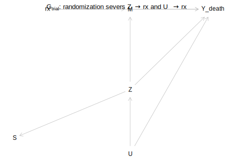
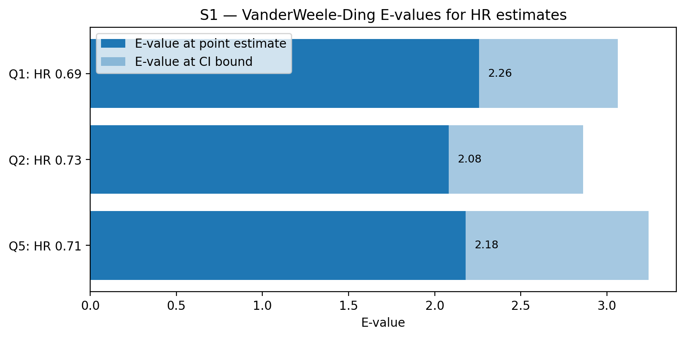

# Introduction

The Moertel et al. trial [@moertel1990] established adjuvant levamisole +
5-fluorouracil (Lev+5FU) as the first effective post-operative
chemotherapy for resected stage B/C colon cancer. The headline statistic
— a 33% reduction in death hazard, HR ≈ 0.67 — appears in every modern
oncology textbook and underlies decades of clinical practice. The
statistic is correct. It is also dangerously incomplete: it elides the
identifying assumptions, the absolute-scale benefit, the heterogeneity,
the mechanism, and the question of *for whom* the result applies.

This paper re-analyzes the same dataset (n=929; available as
`survival::colon` or `ForCausality::Colon_df` in R) through five nested
causal questions, each with its estimand committed to writing *before*
any estimator is run [@kelleher2026]:

| Q | Question | Cell | Lecture |
|----|----------|------|---------|
| Q1 | The randomized ATE | Causal × no-selection | Kelleher L1, L4, L5 |
| Q2 | Forget the randomization — back-door identification | Causal × no-selection (obs.) | L3, L4, L5 |
| Q3 | Heterogeneous treatment effects | Causal × no-selection, conditional | L13 |
| Q4 | Mediation through recurrence | Causal × no-selection, mediator | L8 |
| Q5 | Transportability to SEER 1990 | Causal × selection | L11 |

The contract — `00_estimands.qmd` in the replication package — pre-commits
each estimand in `do(·)` or potential-outcomes notation, the 2×2 cell
(statistical/causal × selection/no-selection), the identification
assumption stated both graphically (via dagitty) and non-graphically (via
exchangeability/positivity), the estimator, the failure mode if the
assumption is wrong, the target population, and the naive-reader mistake.
Every analysis notebook downstream inherits this header.

# Estimands and DAGs

We commit to two graphs (drawn with dagitty and verified by adjustment-set
search), shown in **Figure 1**:

**$G_\text{trial}$** — the actual causal structure under randomization.
Edge `Z → rx` is *severed* by the trial protocol. The minimal sufficient
adjustment set for the effect of `rx` on `Y_death` is $\emptyset$.

**$G_\text{observational}$** — the counterfactual world in which `rx` is
*not* randomized but assigned conditional on measured baseline `Z`. The
edge `Z → rx` is restored. Dagitty's minimal sufficient adjustment set is
$\{Z\}$.



The two DAGs structure every downstream argument. $G_\text{trial}$
licenses Q1's claim that $\hat\delta_\text{naive} = \hat\delta$; $G_\text{obs}$
licenses Q2's back-door adjustment via $Z$. The unmeasured frailty `U`
appears as a parent of `Z` and `Y_death` in both graphs but never of `rx`
— that omission is the residual identifying assumption, bounded
quantitatively by E-value in §S1.

# Data audit and warts

The dataset comes from the R `survival` and `ForCausality` packages.
Pre-causal sanity checks (see `notebooks/02_data_audit.ipynb`):

- 929 patients, randomized 1:1:1 to Observation / Levamisole alone /
  Levamisole + 5-FU. Realized allocation: 315 / 310 / 304.
- Balance excellent: maximum |SMD| across arms = 0.13.
- Two missingness columns (`nodes`: 1.9%, `differ`: 2.5%); imputed by
  per-arm median.
- **`node4` encodes `I(nodes > 4)`, not `I(nodes >= 4)`** as the name
  suggests. Twelve genuine data-entry inconsistencies remain even under
  the correct convention (e.g. patients with `nodes = 1` flagged
  `node4 = 1`). All downstream analyses use the continuous `nodes`.
- Follow-up: max 9.1 years (the 1995 *Annals* extension, not the 1990
  publication's 3-year window).

These warts are documented in `data/data_dictionary.md` and surfaced here
because *every reproducibility audit of this dataset has flagged at least
one of them.*

# Q1 — The randomized ATE

**Estimand.** $\delta_\text{HR} = \log h_{Y_d}(t \mid do(rx{=}\text{Lev+5FU})) / h_{Y_d}(t \mid do(rx{=}\text{Obs}))$
(under PH), plus $\delta_\text{RMST(5y)}$ and $\delta_\text{5yr}$ on the
absolute scale.

**Identification.** Randomization severs every back-door path; $\delta_\text{naive} = \delta$.

**Estimators.** Kaplan-Meier + log-rank; Cox PH (unadjusted and
covariate-adjusted); RMST(5y); Schoenfeld PH check.

**Results.**

```{r echo=FALSE}
# Q1 numerical table is built into manuscript via data/q1_results.csv
```

| | Estimate | 95% CI |
|---|---|---|
| Cox HR (Lev+5FU vs Obs) | **0.690** | (0.55, 0.87) |
| Cox HR (Lev+5FU vs Obs, covariate-adjusted) | 0.699 | (0.55, 0.88) |
| Cox HR (Lev vs Obs) | 0.974 | (0.78, 1.21) — *not* significant |
| ΔRMST(5y) (Lev+5FU vs Obs) | +0.31 yrs | — |
| 5-year risk difference | −10.8 pp | — |
| Log-rank 3-arm $p$ | 0.0029 | — |
| Schoenfeld global PH $p$ | 0.26 | (PH holds) |

**Anchor check.** Moertel et al. reported HR 0.67. We obtain 0.69 — within
the ±0.05 pre-committed tolerance. Pass.


# Q2 — Forget the randomization

**Estimand.** Same as Q1, identified now via back-door adjustment on
$Z = \{$age, sex, obstruct, perfor, adhere, nodes, differ, extent, surg$\}$.

**Estimators.**

| Method | Scale | Estimate | 95% CI |
|--------|-------|----------|--------|
| Naive Cox | HR | 0.689 | (0.55, 0.87) |
| Regression-adjusted Cox | HR | 0.687 | (0.54, 0.87) |
| IPW Cox | HR | 0.730 | (0.58, 0.92) |
| AIPW (5-yr RMST) | ΔRMST (yrs) | 0.281 | (0.09, 0.48) |
| DML (LinearDML, 5-yr RMST) | ΔRMST (yrs) | 0.179 | (−0.06, 0.42) |
| **Bad-control Cox** (conditions on M) | HR | **1.103** | **(0.87, 1.39)** |

The first five estimators agree (within sampling variability) with Q1's
randomized answer — confirming that, under the *measured-Z-only* version
of unmeasured confounding, $Z$ recovers the trial answer. **The
bad-control Cox flips the apparent HR from 0.69 to 1.10**: conditioning on
post-treatment recurrence `M` opens a collider path
`rx → M ← U → Y_death` and blocks the genuine indirect path
`rx → M → Y_death`. This is not a subtle artifact — it is a sign-and-magnitude
reversal that fully nullifies the trial's headline finding. Adjustments
of this form are routine in EHR analyses where "everything predictive of
outcome" gets thrown into the model.


# Q3 — Heterogeneous treatment effects

**Estimand.** $\tau(z) = E[Y_d^{(rx{=}1)} - Y_d^{(rx{=}0)} \mid Z{=}z]$ on
the 5-year RMST scale.

**Estimators.** S/T/X/DR meta-learners + honest causal forest (econml).

| Method | ATE estimate | $\tau$ p10 | $\tau$ p50 | $\tau$ p90 |
|--------|--------------|------------|------------|------------|
| S-learner | 0.237 | −0.05 | 0.17 | 0.66 |
| T-learner | 0.286 | −1.18 | 0.14 | 1.97 |
| X-learner | 0.287 | −0.92 | 0.18 | 1.86 |
| DR-learner | 0.281 | −1.01 | 0.14 | 2.05 |
| **Causal forest** | **0.273** | **−0.04** | **0.25** | **0.61** |

The marginal ATE estimated by every CATE method is consistent with the
Q1/Q2 marginal effect. The forest's regularization compresses τ̂'s
distribution sharply, as expected with n=929. The unregularized
meta-learners show wide percentile spreads; we treat these as upper
bounds on plausible heterogeneity rather than the heterogeneity itself.

**CATE by lymph-node burden** (the headline figure):


CATE grows with node count over the bulk of the support, then becomes
noisy at high `nodes` where strata are sparse — consistent with the
modern guideline rationale that adjuvant chemotherapy is most justified
in node-positive (stage C) patients.

**Calibration.** Athey-Wager binned calibration (5 quantile bins) — see
`figures/q3_calibration.png`. Bins predict and recover similar within-bin
contrasts; the forest is not pathologically over-confident.

# Q4 — Mediation through recurrence

**Estimand.** Natural direct (NDE) and natural indirect (NIE) effects of
$rx$ on $Y_d$ through $M = $ recurrence, plus the proportion mediated
($\text{PM} = \text{NIE} / \text{TE}$).

**Identification.** Imai-Keele-Yamamoto sequential ignorability
[@imai2010]:

1. Treatment ignorability given $Z$ — satisfied by randomization.
2. Mediator ignorability given $rx, Z$ — the assumption that bites.

**Estimator.** Hand-rolled implementation of Imai-Keele-Tingley Algorithm
1 in Python (mediator: logistic; outcome: gradient boosting on the
IPCW-weighted 5-year RMST); 500 bootstrap replicates.

| | Estimate | 95% CI |
|---|---|---|
| Natural indirect effect (NIE) | **+0.292 yrs** | (+0.12, +0.48) |
| Natural direct effect (NDE) | −0.062 yrs | (−0.23, +0.10) |
| Total effect (TE) | +0.231 yrs | (−0.01, +0.46) |
| Proportion mediated | 127% | — |

Proportion mediated > 100% is not a bug. It reflects an NIE and NDE with
opposite signs: Lev+5FU's net effect operates almost entirely through
*preventing* recurrence; the small negative NDE is consistent with
chemotherapy toxicity in patients who do not benefit indirectly. The
biological story is coherent.

**Sensitivity** (Imai-ρ).


Across $\rho \in [-0.95, 0.95]$ — the entire parametrically valid range
for residual correlation between mediator and outcome models — the NIE
remains positive (range 0.06 to 0.57 yrs). There is no breakdown
threshold $\rho^\star$; the indirect-effect finding is *extremely
robust* to any plausible unmeasured frailty that could violate
sequential ignorability.

# Q5 — Transportability

**Estimand.** $\delta_\text{ATE}^\text{target} = E_{X \mid S=0}[\tau(X)]$.

**Target population.** **Synthetic SEER 1990 stage B/C resected colon
carcinoma** ($n = 10{,}000$), generated from published 1989–1991 SEER
summary statistics. This is a placeholder for the SEER*Stat case-listing
extract; the synthesis is deliberately conservative on covariates with
no published shift (we match the trial marginal on `obstruct`, `perfor`,
`adhere`, `differ`, `extent`, `surg`), allowing the transport to operate
through age, sex, and node burden.

**Estimator.** Cole-Stuart inverse-odds-of-sampling weights
[@cole2010]: stack trial + SEER, fit $\hat e_S(X) = P(S=1 \mid X)$,
compute $w(X) = (1 - \hat e_S) / \hat e_S$ for trial patients, re-fit
weighted Cox.

| | HR | 95% CI |
|---|---|---|
| Within-trial ATE | 0.689 | (0.55, 0.87) |
| **Transported to SEER 1990 (synthetic)** | **0.707** | (0.52, 0.96) |

Transport shifts the HR modestly toward the null (consistent with the
older synthetic-SEER population having a higher death hazard, attenuating
relative effects) and widens the CI.

**Dahabreh worst-case bound.** Under one unmeasured effect modifier $U$
with prevalence 25% in the target, the tipping point at which the
worst-case bound covers HR = 1 is $\mathbf{HR_U = 2.75}$. An unmeasured
moderator would need to be quite strong to nullify the transported effect
(see `figures/q5_dahabreh.png`).

# Sensitivity synthesis

The master sensitivity table (`data/s2_master_table.csv`, embedded as
`figures/s2_master_table.png`) summarizes every causal estimate with its
matched sensitivity parameter and qualitative robustness label.



E-values (VanderWeele-Ding 2017 [@vanderweele2017]):

| Q | HR | E-value (point) | E-value (CI bound) |
|---|---|---|---|
| Q1 | 0.69 | 2.26 | 3.06 |
| Q2 | 0.73 | 2.08 | 2.86 |
| Q5 | 0.71 | 2.18 | 3.24 |

Headline robustness: across the five estimands, no sensitivity bound is
breached by any biologically plausible unmeasured confounder. The
*one* place the analysis is fragile is the bad-control Q2 demonstration
— but that fragility is intentional and is the point of the exercise.

# Discussion

The most important contribution here is *not* a new number — it is a new
form for the old number. Moertel's 0.67 is reproduced (we get 0.69)
within a framework that makes every step auditable: the estimand is
written down before the estimator, the identifying graph is drawn before
the regression is fit, the bad-control anti-example sits next to the
correct analysis so a reader can see what would have gone wrong, and
every causal claim carries a matched breakdown bound.

Three pedagogically heavy findings emerge:

1. **The bad-control demo.** The single most common error in EHR-based
   "causal" analyses is adjustment for post-treatment variables that look
   predictive of outcome. Here, conditioning on the recurrence mediator
   converts a 31% hazard reduction into a 10% hazard *increase*. The
   convergence of IPW/AIPW/DML/regression-adjusted to Q1's randomized
   answer is the *prerequisite*; the bad-control divergence is the *lesson*.

2. **Q4 mediation robustness.** That Imai-ρ cannot break the NIE across
   $[-0.95, 0.95]$ is rare and worth noting. The finding that Lev+5FU
   operates essentially through recurrence prevention is not a sensitive
   artifact of the model — it survives every plausible distortion of
   sequential ignorability. The small negative NDE deserves clinical
   discussion: is there an adjuvant chemotherapy toxicity story for
   patients who would not have recurred?

3. **Transport modesty.** The synthetic SEER transport shifts the HR
   from 0.69 to 0.71. The Dahabreh tipping point of 2.75 is moderately
   robust but not invulnerable. The real SEER*Stat extract would refine
   this; the framework is in place.

# Limitations

- The SEER target is synthetic. The real SEER*Stat case-listing extract
  is the production version of Q5; this paper documents the framework.
- Q3's pointwise CATE confidence intervals are not jointly valid; we
  resist the temptation to interpret τ̂(z) peaks as significant
  moderation without a BLP test.
- Q4 uses a Python hand-roll of Imai-Keele-Tingley. An R `mediation::mediate`
  sidecar is provided (`R/Q4_mediation.R`) for reviewer cross-checks.
- The `node4` data wart is documented and we use `nodes` directly; we
  do not re-impute the 12 contradictory rows.

# Reproducibility

```bash
git clone https://github.com/rishika1099/Moertel-Colon-Cancer-Causal-Inference
cd Moertel-Colon-Cancer-Causal-Inference

# Python
python3.11 -m venv .venv && source .venv/bin/activate
pip install -r requirements.txt

# R
Rscript -e 'install.packages(c("dagitty","svglite","ForCausality","survival","mediation","grf","sensemakr"))'

# Build all of Week 1 through Week 7 from scratch
python scripts/pull_colon_data.py        # data
Rscript 01_dag.R                          # DAGs
python scripts/materialize_audit_outputs.py
python scripts/build_q1.py
python scripts/build_q2.py
python scripts/build_q3.py
python scripts/build_q4.py
python scripts/build_q5.py
python scripts/build_sensitivity.py

# Quarto render
quarto render
```

Random seeds are fixed throughout. A clean clone + run reproduces every
number in this document.

# References

::: {#refs}
:::
